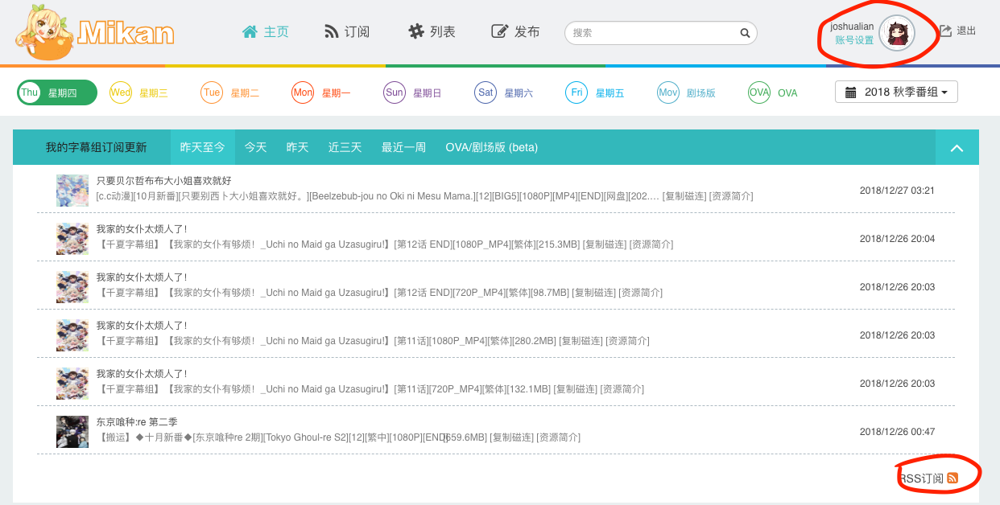
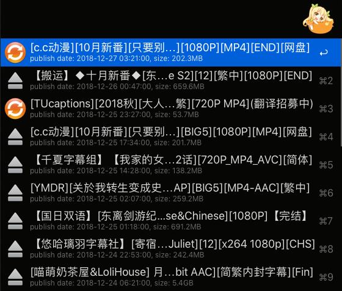
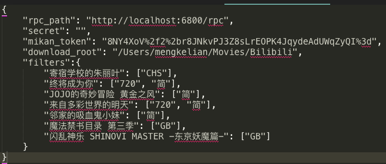

# Mikan Project RSS
An Alfred workflow to view Mikan Project RSS and manage downloads.

This workflow is implemented using Python library [alfred-workflow](https://github.com/deanishe/alfred-workflow).

## Dependencies

* You must have [Alfred 3](https://www.alfredapp.com/) with PowerPack purchased so that the workflow feature is unlocked.  
  你需要购买[Alfred 3](https://www.alfredapp.com/)的PowerPack来解锁workflow的功能
* [Aria2](https://aria2.github.io/) is required if you want to enable shortcut for downloading.  
  你需要安装[Aria2](https://aria2.github.io/)来配合使用这个workflow的下载管理功能

## Usage

### Setup Configurations

1. Go to [Mikan Project](https://mikanani.me/), get an account and sign in, subscribe all your interested series and subtitle groups.   
   先注册一个[蜜柑计划](https://mikanani.me/)的账户, 登入以后在网页内订阅你在追的番剧以及字幕组
2. Click on the icon on the right of `RSS订阅`, copy your token.   
   点击首页的`RSS订阅`图标会新开一个页面, 在里面找到你的token并复制下来
   
3. In Alfred, type `mikan_setting` to open the configuration file, input your token to filed `mikan_token`.   
   在Alfred里输入`mikan_setting`会打开设置文件, 将刚才复制的token填进`mikan_token`这一项里
4. **(Optional)** Type `mikan_setting` to open the configuration file, set the `rpc_path` and `secret` to connect with your Aria2.   
   You can also set the `download_root`, once this directory is set, the downloads will be grouped into folders according to series name.   
   If `download_root` is empty, then all download will be downloaded into the default directory of Aria2.   
   **(选作)** 在Alfred里输入`mikan_setting`会打开设置文件, 设置`rpc_path`和`secret`来连接Aria2.   
   你还可以通过设置`download_root`来指定下载路径, 一旦被指定, 之后的下载的剧集都会存入对应番剧名称的文件夹里.   
   如果`download_root`为空, 所有文件会被下载到Aria2的默认下载路径

### Features

* Items showed in Alfred are searchable   
  所有Alfred显示的条目都是可搜索的
* Downloaded items will be indicated as the "Sync" icon   
  已下载剧集与未下载剧集可以通过图标来区分
* holding `shift` modifier will show the title in subtitle in a smaller font (as the title is usually too long to fit Alfred window)   
  长按`shift`可以将过长的剧集名称放在副标题显示
* pressing `shift` modifier will show series poster   
  点击`shift`可以显示番剧海报
* `fn` modifier will copy the metadata to clipboard   
  通过`fn`修饰符可以将剧集元数据复制到剪贴板
* `ctrl` modifier will open the bangumi page of the selected series   
  通过`xtrl`修饰符可以打开番剧主页面
* `alt` modifier will add BT task of selected item to Aria2 download queue   
  通过`alt`修饰符可以将当前剧集BT下载加入Aria下载队列
* `cmd` modifier will add magnet task of selected item to Aria2 download queue   
  通过`cmd`修饰符可以将当前剧集磁力下载加入Aria下载队列

### Add Custom Filter

Some subtitle group will upload multiple version of the same episode, like [1080P][GB], [1080P][BIG5], [720P][GB], [720P][BIG5].
To further filter the results such that Alfred only show the item we want to download, we can add a white list in the settings.

In the settings, `filters` is a dictionary where the key is the series name same as Mikan home page, value is a list of keywords that must exists in the item title.

有些字幕组对同一剧集会发布多种版本, 比如[1080P][GB], [1080P][BIG5], [720P][GB], [720P][BIG5], 我们可以自己添加白名单来进一步过滤RSS得到的条目.
在设置文件中, 我们可以对`filters`这一项进行修改, 其中key是蜜柑计划主页里番剧的名字, value是剧集标题必须包含的子串

### Cache Update

Once the workflow is triggered in Alfred, if the cache age exceeds the maximum age (20 minutes), an automatic update will run in background.
Manually update is also available by typing `mikan_update` in Alfred.

每当激活workflow时, 如果缓存寿命已经超过20分钟, 新的一轮缓存就会在后台运行.
通过在Alfred里输入`mikan_update`可以手动更新缓存

## License

MIT